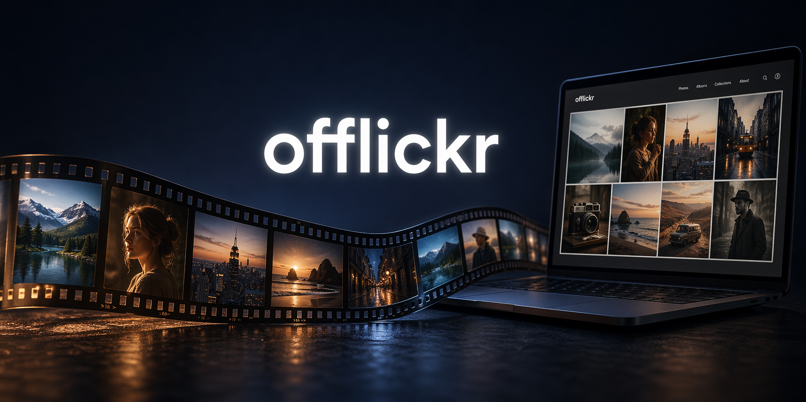
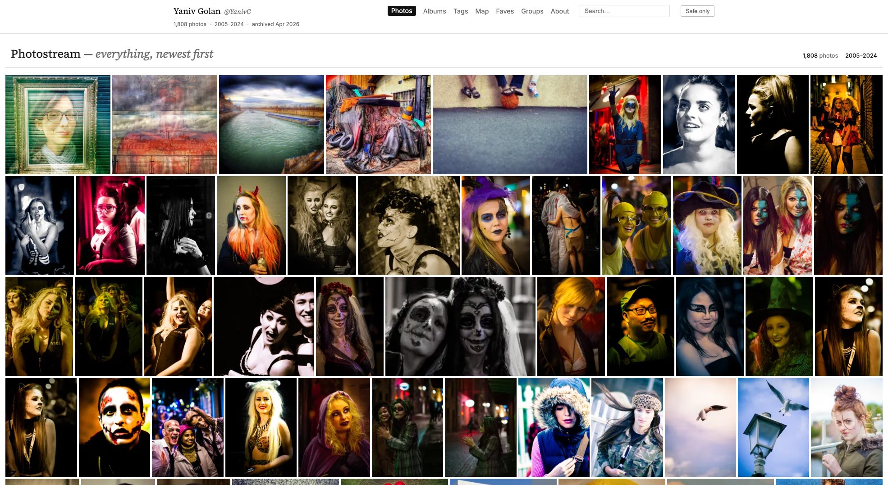
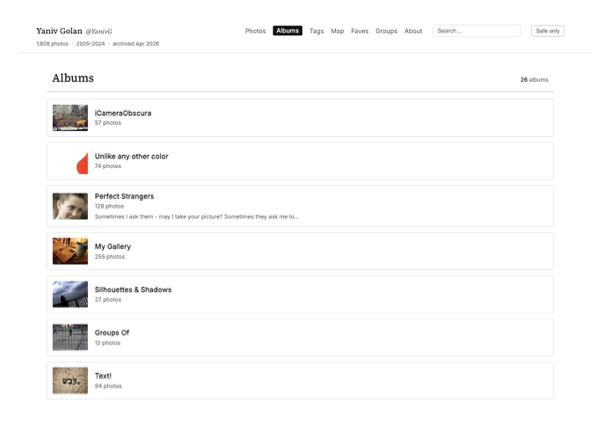
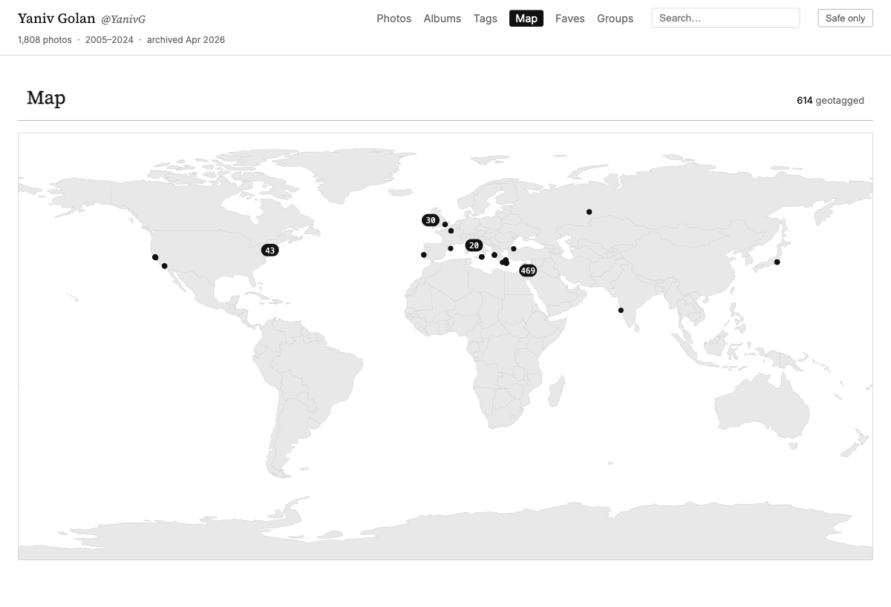

# offlickr



[](https://github.com/yaniv-golan/offlickr/actions/workflows/ci.yml)
[](https://github.com/yaniv-golan/offlickr/actions/workflows/release.yml)
[](https://pypi.org/project/offlickr/)
[](https://pypi.org/project/offlickr/)
[](https://codecov.io/github/yaniv-golan/offlickr)
[](./LICENSE)
[](https://github.com/astral-sh/ruff)

**offlickr** turns a Flickr [*Your Flickr Data*](https://www.flickrhelp.com/hc/en-us/articles/4404079675156-Downloading-content-from-Flickr) export into a self-contained static website — a browsable offline archive of your photostream, albums, galleries, and profile. Zero runtime dependencies, works from `file://`, USB stick, or any static host.

> **Status:** alpha (v0.1.0). Ingest, derive, render, and external asset fetch are all working.
>
> **New to the command line?** Copy this prompt into Claude, ChatGPT, or any AI assistant:
>
> ```text
> Read https://raw.githubusercontent.com/yaniv-golan/offlickr/main/llms.txt and guide me, step by step, how to archive my Flickr account for safe-keeping.
> ```

## Quickstart

```bash
pipx install offlickr        # or: uv tool install offlickr

# Request your Flickr data from https://www.flickr.com/account
# (delivers ~5 zip files by email — put them in one folder)

offlickr build ~/Downloads/flickr-export -o ~/my-flickr-archive
offlickr serve ~/my-flickr-archive    # opens http://127.0.0.1:8000
```

## Why

Flickr accounts outlive Flickr's business decisions. If you care about your photos, comments, and the decade-plus of conversations attached to them, you want a local archive you can browse exactly like the site, without depending on Flickr being up.

The data layer (`data/model.json` + `originals/`) is independent of the rendered site — thumbnails and HTML are fully regeneratable. See [What to keep](docs/getting-started.md#what-to-keep) for what actually needs to go into cold storage.

## Features

- Replicates the structure of `flickr.com/photos/<you>/`: photostream, albums, galleries, groups list, faves, tags, geo map, about, testimonials.
- Per-photo detail pages with description, comments, EXIF, notes, and links back to flickr.com.
- Two themes (`minimal-archive` default, `flickr-classic` alternative).
- Private by default: Flickrmail, contacts, followers, and non-public photos are excluded unless you opt in with `--include-private` and `--include-private-photos`.
- Optional external-asset caching (`--archive-external`) to include avatars and fave thumbnails from other Flickr accounts. Requires a free Flickr API key — see [external fetching](docs/external-fetching.md). No API key is needed for the core archive.

## Screenshots

| Photostream | Albums | Map | Photo detail |
| --- | --- | --- | --- |
| [](docs/screenshots/photostream.png) | [](docs/screenshots/albums.png) | [](docs/screenshots/map.png) | [](docs/screenshots/photo-detail.png) |

## Documentation

- [Getting started](docs/getting-started.md)
- [CLI reference](docs/cli-reference.md)
- [Data model](docs/data-model.md)
- [llms.txt](llms.txt) — LLM-friendly doc index

## Contributing

See [CONTRIBUTING.md](./CONTRIBUTING.md). This project is strictly test-driven.

## License

[MIT](./LICENSE).
